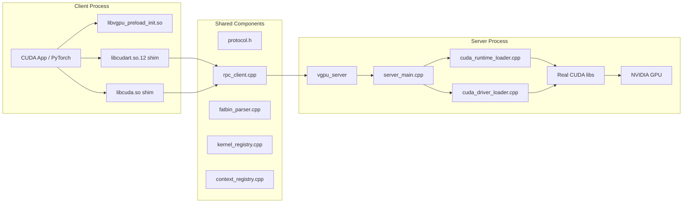

# Virtual-GPU Design

## 1. Goal

Virtual-GPU transparently forwards CUDA Runtime and Driver API calls from a client process to a server process on the same machine that holds the real GPU.

Design priorities:

1. Support the high-frequency core path: memory allocation, memcpy, kernel launch.
2. Maintain both Runtime and Driver API entry points.
3. Keep code structure clear for incremental improvement.

## 2. Non-Goals

- Full CUDA compatibility layer
- Distributed multi-machine GPU scheduling
- cuBLAS / cuDNN / NCCL proxy layers
- Complete CUDA Graph / IPC / Peer Access / VMM semantics

## 3. System Overview

## 4. Layers and Responsibilities

### 4.1 Frontend

Runs in the client process. Exports shim symbols, collects parameters, constructs RPC requests, handles responses.

**Key files:**

- `src/frontend/interceptor.cpp` — Runtime API entry point. Handles `cudaMalloc`, `cudaMemcpy`, `cudaLaunchKernel`, `__cudaRegisterFatBinary`, `__cudaRegisterFunction`.
- `src/frontend/driver_interceptor.cpp` — Driver API entry point. Handles `cuModuleLoadData`, `cuModuleGetFunction`, `cuLaunchKernel`, device/context/stream/event interfaces.
- `src/common/dlopen_hook.cpp` — Interposes `dlopen` / `dlsym` to redirect framework library loading to shim libraries.
- `src/common/cuda_preload_init.cpp` — Preload initialization timing.

**Compatibility strategy:** Frontend functions fall into three categories:

1. **Full forwarding** — Parameters encoded and sent to server (e.g., `cudaMalloc`, `cudaLaunchKernel`).
2. **Compatibility stubs** — Return success with reasonable defaults for framework probing (e.g., `cudaGetDeviceProperties` returns a plausible device profile).
3. **Explicit not-supported** — Return `cudaErrorNotSupported` / `CUDA_ERROR_NOT_SUPPORTED` for capabilities that are genuinely absent (IPC, Graph, MemPool, UVM, etc.).

The boundary between categories 2 and 3 is: if returning success would cause the framework to proceed with a code path that silently produces wrong results, return not-supported instead.

### 4.2 Common

Shared protocol and metadata layer between frontend and backend.

**Key files:**

- `include/vgpu/common/protocol.h` — Defines `RpcOp`, `RpcDrvOp`, request/response headers, payload structures.
- `src/common/rpc_client.cpp` — Unix Domain Socket RPC client with connection management and timeout handling.
- `src/common/fatbin_parser.cpp` — Extracts kernel parameter layout from fatbin / PTX images.
- `src/common/kernel_registry.cpp` — Maps fake handles to server-side module/function IDs; caches parameter layouts.
- `src/common/context_registry.cpp` — Allocates stable context IDs per device.
- `include/vgpu/frontend/shim_utils.h` — Shared frontend helpers: fatbin image parsing, argument packing, `/proc/self/maps` access checks, environment variable utilities.

### 4.3 Backend

Runs in the server process. Receives RPC requests, dispatches to real CUDA libraries.

**Key files:**

- `src/backend/server_main.cpp` — Server entry point. Socket accept, per-connection request handling, Runtime/Driver dispatch.
- `src/backend/cuda_runtime_loader.cpp` — Dynamically loads real `libcudart.so`, resolves symbols.
- `src/backend/cuda_driver_loader.cpp` — Dynamically loads real `libcuda.so`, resolves symbols.

## 5. Key Execution Paths

### 5.1 Memory Operations

Using `cudaMemcpy` (H2D) as an example:

1. Application calls `cudaMemcpy(dst, src, count, cudaMemcpyHostToDevice)`.
2. Frontend encodes parameters as `RpcMemcpyReq`.
3. Host source data sent as extra payload.
4. Server decodes and calls real `cudaMemcpy`.
5. Server returns status.
6. For D2H direction, server sends result data back as payload; frontend copies to caller's buffer.

### 5.2 Runtime Kernel Launch

The most critical Runtime path:

1. NVCC triggers `__cudaRegisterFatBinary` at program startup or module load.
2. Frontend uploads fatbin to server, receives `module_id`.
3. Frontend uses `fatbin_parser` to extract parameter layout, caches in `kernel_registry`.
4. `__cudaRegisterFunction` exchanges function name for `func_id` with server.
5. At `cudaLaunchKernel` time, frontend packs `void** args` into contiguous buffer using cached `ParamInfo`.
6. Request sent as `RpcCuLaunchKernelReq` + argument buffer.
7. Server calls real `cuLaunchKernel`.

Parameter metadata is resolved at registration time to minimize overhead at launch time.

### 5.3 Driver Direct Path

Using `cuModuleLoadData` -> `cuModuleGetFunction` -> `cuLaunchKernel`:

1. Driver shim forwards fatbin to server as-is.
2. Server loads module, returns `module_id`.
3. Frontend creates a fake `CUmodule` handle, records fake-to-server mapping in `kernel_registry`.
4. `cuModuleGetFunction` exchanges for `func_id`, creates fake `CUfunction` handle.
5. `cuLaunchKernel` looks up `func_id` and parameter layout from local registry, forwards to server.

Core principle: client exposes only fake handles; server holds real `CUmodule` / `CUfunction`; registry bridges the two.

## 6. Handle and Context Model

### 6.1 Fake Handles

Many client-side handles are shim-generated fakes:

- Prevents server-side real pointers from leaking to client.
- Maintains unified local handle model across Runtime and Driver entries.
- Enables registry lookup for `module_id` / `func_id` / parameter info in subsequent calls.

### 6.2 Context IDs

`ContextRegistry` does not create real CUDA contexts on the client. It allocates stable `context_id` values to:

- Organize requests by device dimension.
- Provide consistent request identifiers shared by Runtime and Driver paths.
- Improve server-side log correlation.

## 7. Protocol

Two core enums in `protocol.h`:

- `RpcOp` — Runtime main paths and common queries.
- `RpcDrvOp` — Driver module, memory, launch paths.

**Request:**
- `RpcRequestHeader` (magic, version, op, app_id, context_id, device, payload_size)
- Payload
- Optional extra payload

**Response:**
- `RpcResponseHeader` (status, aux_u64, payload_size)
- Payload

`aux_u64` commonly returns: device count, stream/event pointers, module_id/func_id.

## 8. Fatbin Image Handling

Fatbin images have two formats:

- **Wrapper magic** (`0x466243B1`): 8-byte header followed by pointer to actual fatbin data.
- **Fatbin magic** (`0xBA55ED50`): Direct fatbin data with header containing size information.

CUDA 12+ uses an extended header: `u32 magic, u32 version, u64 data_size, u32 unknown, u32 header_size`. Legacy layout uses `u32 header_size @8, u32 data_size @12`.

Parsing logic is in `shim_utils.h` (`resolveRawFatbinPtr`, `fatbinImageSize`), shared between Runtime and Driver shims.

## 9. dlopen Interception

`dlopen_hook.cpp` interposes the system `dlopen` and `dlsym` symbols using `LD_PRELOAD`. When a process attempts to load `libcuda.so` or `libcudart.so`, the hook redirects to the shim libraries instead.

Key implementation details:
- Uses `dlvsym(RTLD_NEXT, ...)` with `GLIBC_2.2.5` to resolve the original `dlopen` without recursion.
- Thread-local reentrancy guard prevents infinite recursion.
- Falls back to loading the original library if shim loading fails.
- Debug logging controlled by `VGPU_DEBUG` environment variable.

## 10. Export Table and Symbol Resolution

### 10.1 cuGetProcAddress — Symbol Resolution Strategy

`cuGetProcAddress` resolves CUDA Driver API symbols using a two-tier strategy:

**Intercepted symbols** (memory, kernel launch, modules, streams, events, context, device management): Always resolved from the shim's own `libcuda.so`. These are the operations forwarded over RPC to the server.

**Non-intercepted symbols** (export tables, library internals, cuBLAS/cuDNN APIs): Resolved from the real `libcuda.so.1` loaded via `realCudaHandle()`. This lets CUDA libraries like cuBLAS access real driver internals while our intercepted operations remain under RPC control.

The real `libcuda.so.1` is loaded with `RTLD_LOCAL`, so its internal function calls use its own GOT and do not re-enter the shim. This prevents circular interception.

**Optional symbols** (Graph, stream capture, occupancy, etc.): Controlled by `VGPU_EXPOSE_OPTIONAL_CUDA_SYMBOLS`. In strict mode (default), these are not resolved, preventing frameworks from taking unsupported code paths.

### 10.2 cuGetExportTable — Export Table Forwarding

`cuGetExportTable` forwards to the real driver by default when `realCudaHandle()` is available. This is necessary because cuBLAS requires real export tables to function.

Priority order:
1. `VGPU_USE_FAKE_CU_EXPORT_TABLES=1` — explicit override, use fake tables
2. `VGPU_CU_EXPORT_TABLE_SUCCESS_NULL=1` — explicit override, return null
3. Real driver available — forward to real `cuGetExportTable` (default)
4. No real driver — return `CUDA_ERROR_NOT_SUPPORTED`

## 11. Current Limitations and Future Work

### 11.1 Frontend files are large

`interceptor.cpp` and `driver_interceptor.cpp` each contain core forwarding logic, compatibility stubs, and debug diagnostics in a single file. A natural next step would be splitting each into:
- Core forwarding functions
- Compatibility stubs
- Debug / diagnostic helpers

### 11.2 Server dispatch is monolithic

`server_main.cpp` handles all request types in one dispatch function. Could be split into:
- Runtime memory operations
- Runtime stream/event operations
- Driver module operations
- Driver memory operations

### 11.3 Capability matrix should track tests

The most likely source of drift is documentation not matching implementation. README capability claims, DESIGN compatibility strategy, and test assertions should be maintained together.

### 11.4 cuBLAS / cuDNN via real driver passthrough

cuBLAS and cuDNN work through a hybrid approach: their internal CUDA Driver API calls (export tables, context management) are resolved from the real `libcuda.so.1`, while memory allocation and kernel launch go through the vGPU server via RPC.

This is not a full proxy — cuBLAS/cuDNN use the real driver for internal operations directly. The benefit is that cuBLAS/cuDNN work out of the box without implementing RPC proxies for their complex internal APIs. The limitation is that they require a real GPU on the same machine.

Currently, export table stubs only satisfy initialization probing, not actual computation.
