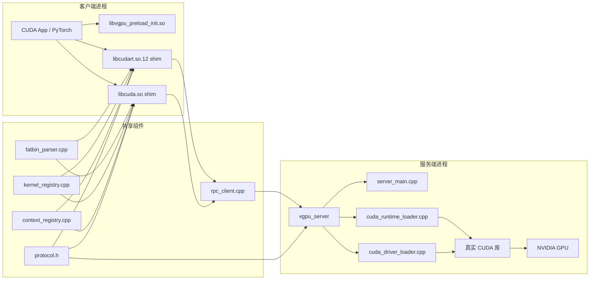

# Virtual-GPU Design

## 1. 目标

Virtual-GPU 的目标是把客户端进程中的 CUDA Runtime / Driver API 调用，透明地转发给本机另一个持有真实 GPU 的服务进程执行。

当前设计关注三件事：

1. 打通高频主路径。
2. 保持 Runtime 和 Driver 两条入口都可用。
3. 让代码结构足够清晰，便于后续继续补齐框架兼容性。

## 2. 非目标

当前实现不是以下方向的完整方案：

- 不是完整的 CUDA 兼容层。
- 不是分布式多机 GPU 调度系统。
- 不是完整的 cuBLAS / cuDNN / NCCL 专用代理层。
- 不是完整的 CUDA Graph / IPC / Peer Access / VMM 语义实现。

## 3. 系统总览

## 4. 分层与职责

### 4.1 Frontend

Frontend 运行在客户端进程内，负责导出 shim 符号、收集参数、构造 RPC 请求、处理服务端响应。

关键文件：

- src/frontend/interceptor.cpp
  - Runtime API 入口。
  - 负责 cudaMalloc、cudaMemcpy、cudaLaunchKernel 等路径。
  - 负责 __cudaRegisterFatBinary 和 __cudaRegisterFunction，接住 NVCC 的 fatbin 注册流程。
- src/frontend/driver_interceptor.cpp
  - Driver API 入口。
  - 负责 cuModuleLoadData、cuModuleGetFunction、cuLaunchKernel 以及常见设备 / 上下文 / 流 / 事件接口。
- src/common/dlopen_hook.cpp
  - 劫持 dlopen / dlsym。
  - 让 PyTorch 等动态加载用户态 CUDA 库的框架优先落到本仓库 shim。
- src/common/cuda_preload_init.cpp
  - 负责 preload 初始化时机控制。

### 4.2 Common

Common 是前后端共享的协议和元数据层。

关键文件：

- include/vgpu/common/protocol.h
  - 定义 RpcOp、RpcDrvOp、请求头、响应头以及 payload 结构。
- src/common/rpc_client.cpp
  - 实现 Unix Domain Socket RPC client。
  - 处理连接、超时、读写完整性。
- src/common/fatbin_parser.cpp
  - 从 fatbin / PTX 中提取 kernel 参数布局。
- src/common/kernel_registry.cpp
  - 维护 module、function、参数布局、fake handle 到 server id 的映射。
- src/common/context_registry.cpp
  - 维护与 device 绑定的 context id 分配逻辑。

### 4.3 Backend

Backend 运行在服务端进程中，负责接收请求、分发执行、调用真实 CUDA 库。

关键文件：

- src/backend/server_main.cpp
  - 服务端入口。
  - 负责 socket accept、按连接处理请求、Runtime/Driver 分发。
- src/backend/cuda_runtime_loader.cpp
  - 动态加载真实 libcudart.so，解析所需符号。
- src/backend/cuda_driver_loader.cpp
  - 动态加载真实 libcuda.so，解析所需符号。

## 5. 关键实现路径

### 5.1 Runtime 内存操作

以 cudaMemcpy 为例：

1. 应用调用 cudaMemcpy。
2. frontend 将参数编码为 RpcMemcpyReq。
3. H2D 时把 host 数据作为 extra payload 发给服务端。
4. 服务端解码后调用真实 cudaMemcpy。
5. D2H 时服务端把结果作为 payload 回传。
6. frontend copy back 到调用者提供的 host 缓冲区。

这个路径的特点是：

- Runtime 语义保持简单直通。
- 请求体固定，数据体可选。
- D2H 方向在客户端有一次额外 copy back。

### 5.2 Runtime kernel launch

这是 Runtime 侧最关键的路径。

1. NVCC 在程序启动或模块加载时触发 __cudaRegisterFatBinary。
2. frontend 把 fatbin 上传到服务端，获得 module_id。
3. frontend 用 fatbin_parser 解析本地参数信息，并缓存到 kernel_registry。
4. __cudaRegisterFunction 再根据函数名向服务端换取 func_id。
5. 真正执行 cudaLaunchKernel 时，frontend 根据 ParamInfo 把 void** args 打包成连续 buffer。
6. 请求通过 RpcCuLaunchKernelReq + arg buffer 发送给服务端。
7. 服务端调用真实 cuLaunchKernel 执行。

当前设计里，参数元数据尽量前置到注册阶段，以减少真正 launch 时的解析成本。

### 5.3 Driver 直通路径

以 cuModuleLoadData -> cuModuleGetFunction -> cuLaunchKernel 为例：

1. Driver shim 将 fatbin 原样转发给服务端。
2. 服务端 load module 后返回 module_id。
3. frontend 本地创建 fake CUmodule handle，并记住 fake handle 到 module_id 的映射。
4. cuModuleGetFunction 时同理换取 func_id，并创建 fake CUfunction handle。
5. cuLaunchKernel 时从本地 registry 找出 func_id 和参数布局，然后转发给服务端执行。

这里的核心思想是：

- 客户端只暴露 fake handle。
- 服务端持有真实 CUmodule / CUfunction。
- 两侧通过 registry 建立映射关系。

## 6. 句柄与上下文模型

### 6.1 fake handle

客户端的很多句柄并不是真实 CUDA 句柄，而是 shim 生成的 fake handle，用于：

- 避免把服务端真实指针暴露回客户端。
- 在 Runtime / Driver 两条入口上维持统一的本地句柄模型。
- 让 registry 能够在后续调用中查回 module_id / func_id / 参数信息。

### 6.2 context id

ContextRegistry 不是在客户端真实创建完整 CUDA context，而是为请求流分配稳定的 context_id，用于：

- 把请求按 device 维度组织起来。
- 让服务端日志和状态关联更明确。
- 让 Runtime/Driver 两条链路共享统一的请求标识方式。

## 7. 协议设计

protocol.h 中的协议有两个核心枚举：

- RpcOp
  - 代表 Runtime 主路径和部分公共查询路径。
- RpcDrvOp
  - 代表 Driver 模块、内存、launch 等路径。

每次请求包含：

- RpcRequestHeader
  - magic
  - version
  - op
  - app_id
  - context_id
  - device
  - payload_size
- payload
- optional extra payload

每次响应包含：

- RpcResponseHeader
  - status
  - aux_u64
  - payload_size
- payload

其中 aux_u64 常用于返回：

- device count
- stream / event / fake pointer
- module_id / func_id

## 8. 兼容策略

当前实现没有把所有 API 都做成“真实语义完整代理”，而是区分三类：

### 8.1 完整转发

例如：

- cudaMalloc / cudaFree
- cudaMemcpy*
- cudaMemset*
- cuModuleLoadData
- cuModuleGetFunction
- cuLaunchKernel

### 8.2 兼容性 stub

例如一些框架初始化时会探测，但不一定在主路径上依赖其完整语义的接口。
这些接口可能返回：

- success + 合理默认值
- not supported

设计目的不是伪装完全支持，而是避免无意义地卡死在框架探测阶段。

### 8.3 明确 not supported

例如当前已确认不应假装成功的路径：

- IPC
- 多数 Graph 相关接口
- MemPool 的完整语义

这些路径显式返回 not supported，避免 silent wrong behavior。

## 9. 当前代码整理结果

本轮整理没有改变协议，也没有重写执行路径，重点是先降低重复样板：

- 新增 include/vgpu/frontend/shim_utils.h
  - 统一前端 shim 里的环境变量布尔开关判断。
  - 统一 /proc/self/maps 的可读 / 可写地址区间检查逻辑。
- runtime 和 driver shim 不再各自维护重复的进程地址区间扫描代码。

这样做的原因很直接：

- 这类逻辑跨文件重复但与业务语义无关。
- 抽出来后不改 RPC、不改协议、不改执行路径，风险最低。
- 后续继续整理时，可以沿着“先抽公共 helper，再拆业务模块”的方向推进。

## 10. 当前代码中仍值得继续整理的点

### 10.1 Frontend 文件仍然偏大

interceptor.cpp 和 driver_interceptor.cpp 仍同时包含：

- 核心转发逻辑
- 大量兼容 stub
- 调试与诊断逻辑

下一步更合理的拆法是：

- runtime 核心路径
- runtime 兼容 stub
- driver 核心路径
- driver 兼容 stub

### 10.2 server_main.cpp 仍然承担过多分发职责

虽然相比早期版本已经拆出多个 helper，但仍然适合继续收缩为更明确的模块边界：

- runtime memory
- runtime stream/event
- driver module
- driver memory

### 10.3 能力矩阵需要持续和测试保持一致

当前最容易失真的不是代码，而是文档口径。因此 README 和 DESIGN 必须跟 tests/python、tests/cpp 一起维护。

## 11. 演进建议

后续如果继续整理，建议顺序如下：

1. 继续抽掉 frontend 中重复的小工具和兼容 stub。
2. 继续收缩 backend 分发函数的体积。
3. 为 README 增加更细粒度的 API 能力矩阵。
4. 在测试中补一组“能力边界回归测试”，专门验证哪些接口应 success、哪些应 not supported。

这个顺序的优点是：每一步都能单独验证，且不会把当前已经打通的主路径重新打乱。
