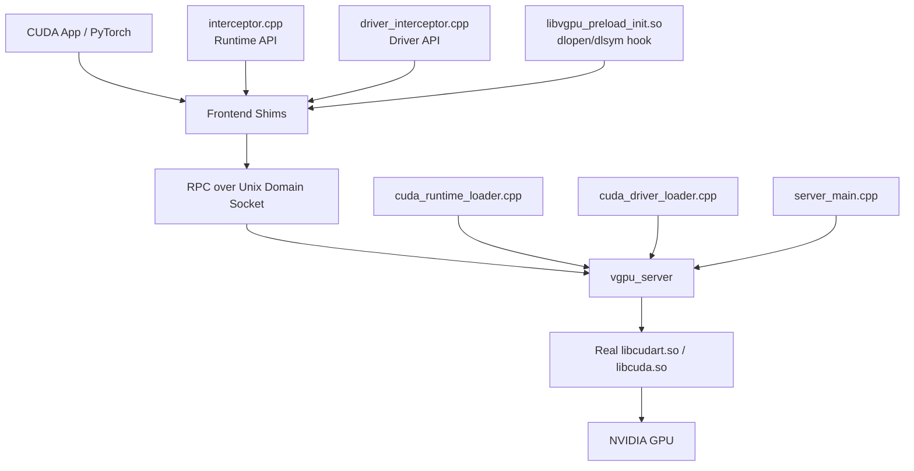

# Virtual-GPU

Virtual-GPU 是一个面向单机后端 GPU 的 CUDA 拦截与远程执行原型。
客户端进程通过本仓库提供的 libcudart.so.12、libcuda.so 和 libvgpu_preload_init.so 拦截 CUDA Runtime / Driver API，再把请求经 Unix Domain Socket 转发给本地 vgpu_server，由服务端在真实 CUDA 库上执行。

项目当前目标不是“完整替代 CUDA 生态”，而是把高频核心路径打通，并保持代码结构清晰、便于继续演进。

## 当前能做什么

- 拦截 Runtime API 常见路径：
	- cudaMalloc / cudaFree
	- cudaMemcpy / cudaMemcpyAsync
	- cudaMemset / cudaMemsetAsync
	- cudaGetDeviceCount / cudaGetDevice / cudaSetDevice
	- cudaStreamCreate / Destroy / Synchronize / Query / WaitEvent
	- cudaEventCreate / Destroy / Record / Synchronize / Query
	- cudaLaunchKernel
- 拦截 Driver API 核心路径：
	- cuModuleLoadData / cuModuleLoadDataEx / cuModuleLoad
	- cuModuleGetFunction
	- cuLaunchKernel
	- cuMemAlloc_v2 / cuMemFree_v2 / cuMemcpyHtoD_v2 / cuMemcpyDtoH_v2 / cuMemcpyDtoD_v2
	- 常见上下文、设备、流、事件查询接口的兼容 stub
- 支持 NVCC fatbin 注册链路：
	- __cudaRegisterFatBinary
	- __cudaRegisterFunction
	- 基于 fatbin / PTX 解析 kernel 参数布局
- 支持 PyTorch 的动态加载入口：
	- 通过 libvgpu_preload_init.so 拦截 dlopen / dlsym
	- 让 PyTorch 走本仓库的 shim，而不是直接走系统 CUDA 库

## 当前做不到什么

- 不能宣称完整支持 CUDA 生态。
- 不支持完整 CUDA Graph 语义。
- 不支持 IPC、Peer Access、Unified Virtual Memory 的完整实现。
- 不提供 NCCL、cuDNN、cuBLAS 的专用 shim 层。
- 默认只支持本机 Unix Domain Socket，不支持远程网络后端。
- 多 GPU 调度、隔离和路由不是当前重点。

## 当前已知边界

- 项目对“普通 CUDA 程序 + 核心 Runtime/Driver 路径”支持较完整。
- 对“框架初始化时探测但不真正执行”的 API，大量采用兼容 stub 返回合理默认值或 not supported。
- 当前 PyTorch 端 torch.cuda 基础初始化已能前进较深，但 torch.matmul 仍未可用。
	- 当前主阻塞是 cuBLAS 初始化路径未闭环。
	- 已知现象是 cublasCreate_v2 仍可能返回 rc=1。
	- 这意味着“PyTorch CUDA 可见”不等于“PyTorch GEMM 已可用”。

## 组件组成

- libvgpu_preload_init.so
	- 预加载初始化库
	- 提供 dlopen / dlsym hook，服务于 PyTorch 等动态加载链路
- libcudart.so.12
	- Runtime API shim
	- 由 src/frontend/interceptor.cpp 导出主要符号
- libcuda.so
	- Driver API shim
	- 由 src/frontend/driver_interceptor.cpp 导出主要符号
- vgpu_server
	- 服务端执行进程
	- 动态加载真实 libcudart.so / libcuda.so 并执行请求

## 系统架构

更详细的实现说明见 DESIGN.md。



## 快速开始

### 1. 构建

```bash
cd /path/to/vGPU
cmake -S . -B build -DCMAKE_BUILD_TYPE=Release
cmake --build build -j
```

### 2. 启动服务端

```bash
export VGPU_SERVER_SOCK=/tmp/vgpu_server.sock
./build/vgpu_server
```

### 3. 运行普通 CUDA 程序

```bash
export VGPU_SERVER_SOCK=/tmp/vgpu_server.sock
export LD_LIBRARY_PATH=/path/to/vGPU/build:$LD_LIBRARY_PATH
./your_cuda_app
```

### 4. 运行 PyTorch 程序

```bash
export VGPU_SERVER_SOCK=/tmp/vgpu_server.sock
export LD_PRELOAD=/path/to/vGPU/build/libvgpu_preload_init.so:/path/to/vGPU/build/libcuda.so:/path/to/vGPU/build/libcudart.so
export LD_LIBRARY_PATH=/path/to/vGPU/build:$LD_LIBRARY_PATH
python your_pytorch_script.py
```

## 测试与验证

### 构建测试目标

```bash
cmake --build build -j
```

### C++ 基础测试

```bash
./build/vgpu_runtime_shim_smoke_test
./build/vgpu_runtime_not_supported_semantics_test
./build/vgpu_runtime_memory_smoke_test
./build/vgpu_runtime_async_event_test
./build/vgpu_runtime_kernel_launch_test
```

### Python 测试

```bash
python -m pytest tests/python -v
```

### 手工 PyTorch 验证

```bash
python tests/python/pytorch_matmul_demo.py
python tests/python/cublas_probe.py
```

## 常用环境变量

| 变量 | 作用 |
| --- | --- |
| VGPU_SERVER_SOCK | 服务端 Unix Domain Socket 路径 |
| VGPU_RPC_TIMEOUT_MS | RPC 超时，单位 ms |
| VGPU_DEBUG | 客户端详细日志 |
| VGPU_VERBOSE | 服务端请求日志 |
| VGPU_FORCE_DEVICE | 服务端强制绑定 device |
| VGPU_DELAY_US | 服务端人为注入延迟 |
| VGPU_MEMCPY_CLAMP_BYTES | 服务端限制单次 memcpy 大小 |
| VGPU_LOG_CU_GETPROC | 记录 cuGetProcAddress / cuGetExportTable 路径 |
| VGPU_USE_FAKE_CU_EXPORT_TABLES | 启用 fake cuGetExportTable 表 |
| VGPU_FAKE_EXPORT_TABLE_WRITEBACK | 控制 fake export table 写回 |
| VGPU_FAKE_EXPORT_TABLE_WRITEBACK_MASK | 按 UUID:arg 精细控制写回位点 |

## 目录说明

- src/frontend
	- 客户端 shim 实现
- src/backend
	- 服务端实现与真实 CUDA loader
- src/common
	- fatbin 解析、RPC client、context registry、kernel registry
- include/vgpu
	- 公共头文件和前端辅助头
- tests/cpp
	- C++ / CUDA 基础测试
- tests/python
	- Python 与 PyTorch 验证脚本

## 代码整理说明

本轮代码整理遵循“低风险、先提高清晰度”的原则，没有改变 RPC 协议和主执行路径，重点做了两类工作：

- 将前端 shim 中重复的小工具函数下沉为共享 helper，减少重复样板。
- 重写文档，使 README 和 DESIGN 反映当前真实能力边界，而不是给出过宽表述。

后续如需继续整理，优先方向是：

1. 继续拆分 frontend 中的兼容 stub 与核心转发逻辑。
2. 继续细化 backend 分发代码的模块边界。
3. 在文档和测试中同步维护“已支持 / 部分支持 / 未支持”的矩阵。
